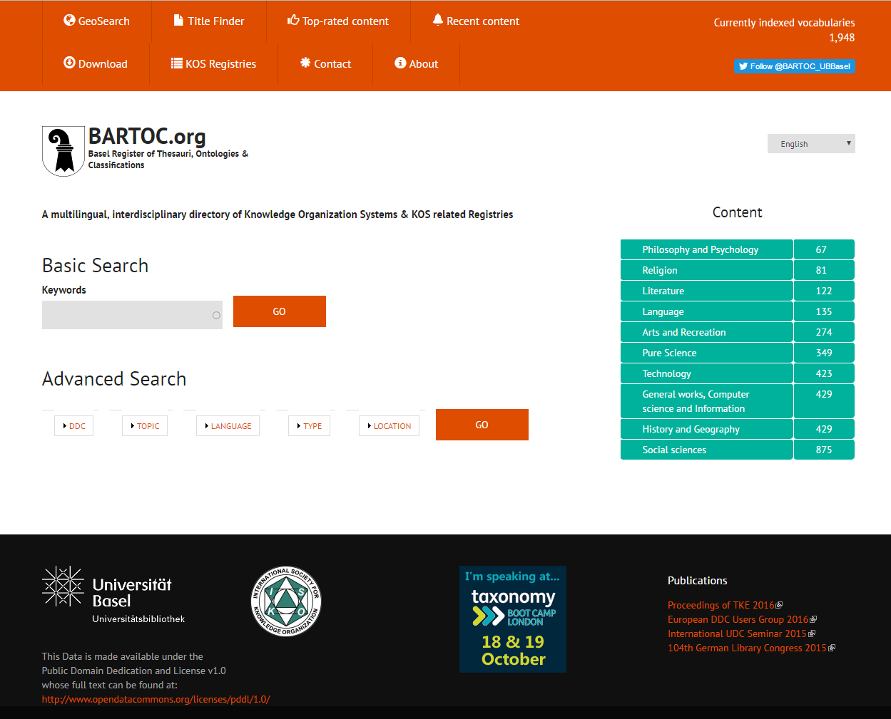
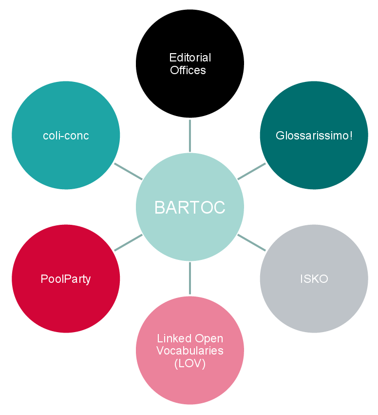
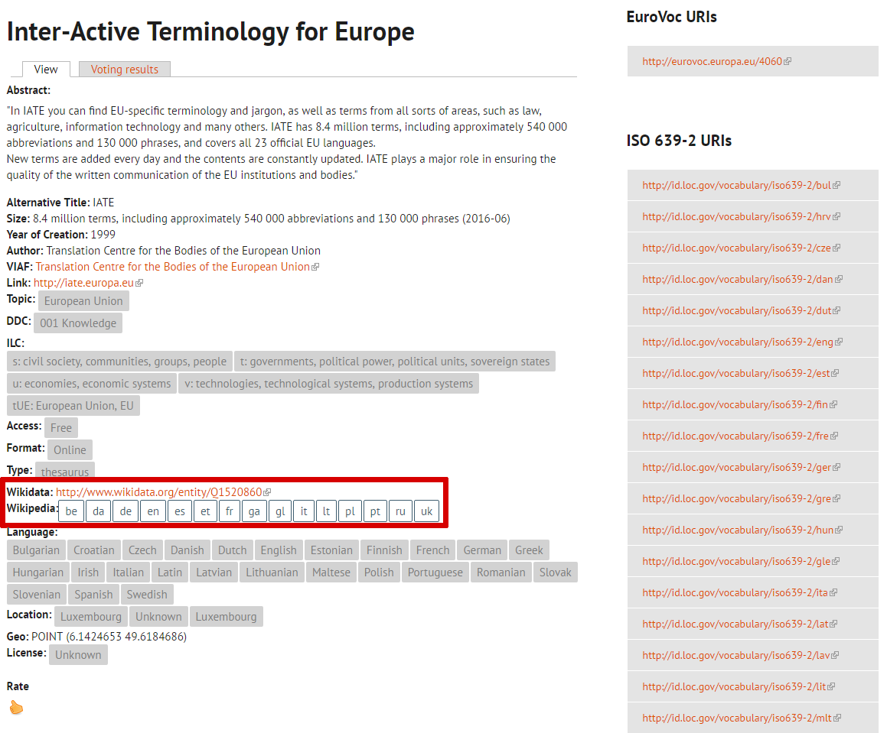
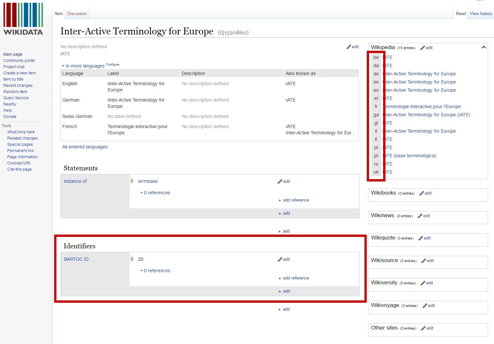
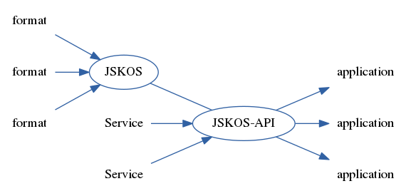
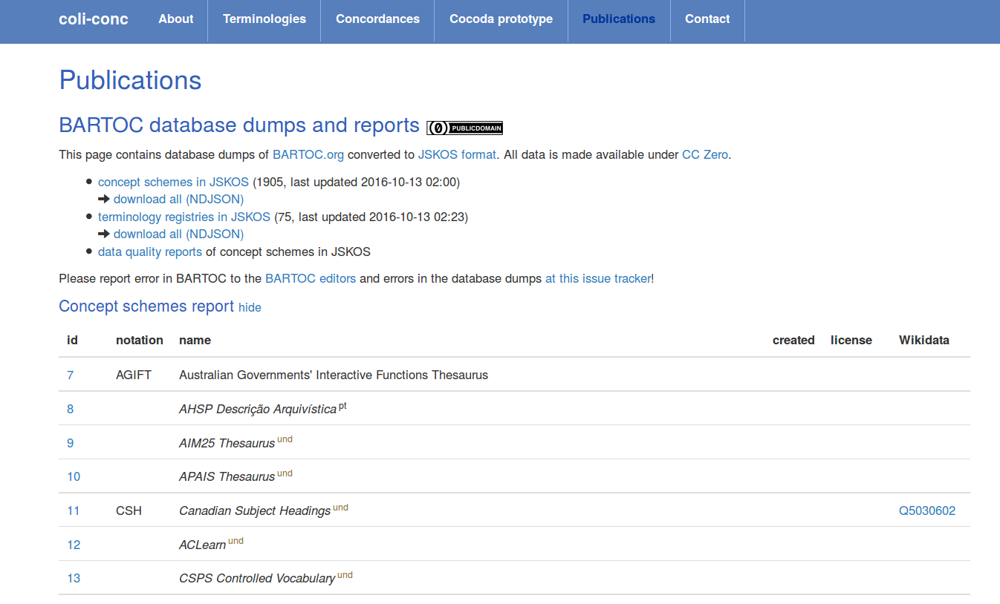

---
title: |
  Interoperability \
  of KOS Metadata Schemas \
  in BARTOC and JSKOS
shorttitle: Interoperability of KOS metadata schemas  
author:
 - name: Jakob Voß
   affiliation: VZG
 - name: Andreas Ledl
   affiliation: UB Basel
#institute: Verbundzentrale des GBV (VZG), Göttingen, Germany
date: 2016-10-16
#subtitle: '[10.5281/zenodo.61767](http://dx.doi.org/10.5281/zenodo.61767)'
place: 16^th^ European NKOS Workshop, Copenhagen
multifilter:
 - arrows
...

# BARTOC.org

{height=75mm}

# Founding Reasons

* Make traditional resources more visible

* Provide key characteristics of resources

* Encourage human and machine assessment of these resources by applicability to
  semantic projects

* Promote information exchange and knowledge sharing

@Marjorie2011: Developing an eclectic terminology registry

# Collaborations

{height=75mm}

# Interoperability

<!--http://bartoc.org/en/node/20-->

{height=77mm}

# Interoperability

{height=75mm}

# NKOS DC Application Profile

@Zeng2015: Networked Knowledge Organization Systems Dublin Core Application Profile (NKOS AP) v0.2

* BARTOC is aligned with NKOS AP

* Some NKOS AP fields are not included or applicable [yet?]

* Additional constraints make sense

<!--
    * prefer links to controlled vocabularies over literals
    * include language tags (e.g. English title)
    * repeatable vs. non-repeatable fields
    * ...
-->

--> BARTOC RDF $\subset$ ( NKOS AP $\cup$ Schema.org $\cup$ FOAF )

# BARTOC KOS Metadata in RDF

\tiny

~~~
<http://bartoc.org/en/taxonomy/term/1> a skos:Concept;
  rdfs:label "thesaurus"@en ; skos:prefLabel "thesaurus"@en . 

<http://bartoc.org/en/node/20> a sioc:Item, schema:Dataset, foaf:Document;
  dc:type <http://bartoc.org/en/taxonomy/term/1>;	   
  schema:name "IATE", "Inter-Active Terminology for Europe"@en;
  dc:title "IATE";
  dc:creator "Translation Centre for the Bodies of the European Union";
  foaf:maker <http://viaf.org/viaf/167896131>,		   
    "Translation Centre for the Bodies of the European Union";
  dc:created "1999"^^xsd:gYear;
  nkos:sizeNote 
    "8.4 million terms, including approximately 540.000 abbreviations and 130 000 phrases (2016-06)" ;
  dc:description "In IATE you can find EU-specific terminology and jargon, as well as terms from all sorts of areas..."
  dc:identifier <http://iate.europa.eu>;
  dc:relation <http://www.wikidata.org/entity/Q1520860>; 
  schema:about 
	<http://bartoc.org/en/taxonomy/term/10656>,	
	<http://bartoc.org/en/taxonomy/term/11597>, 
	<http://bartoc.org/en/taxonomy/term/50220>, 
	<http://bartoc.org/en/taxonomy/term/50430>, 
	<http://bartoc.org/en/taxonomy/term/50770>; 
	<http://bartoc.org/en/taxonomy/term/51043>; 
	<http://bartoc.org/en/taxonomy/term/49253>, 
  dc:language 
	<http://bartoc.org/en/taxonomy/term/10746>, 
	<http://bartoc.org/en/taxonomy/term/10747>, 
	<http://bartoc.org/en/taxonomy/term/10748>, 
	<http://bartoc.org/en/taxonomy/term/10749>, 
    ...
~~~

# BARTOC KOS Metadata in RDF

\tiny

~~~
<http://bartoc.org/en/taxonomy/term/1> a skos:Concept; # == <http://w3id.org/nkos/nkostype#thesaurus>
  rdfs:label "thesaurus"@en ; skos:prefLabel "thesaurus"@en . 

<http://bartoc.org/en/node/20> a sioc:Item, schema:Dataset, foaf:Document;
  dc:type <http://bartoc.org/en/taxonomy/term/1>;	   # == <http://w3id.org/nkos/nkostype#thesaurus>
  schema:name "IATE", "Inter-Active Terminology for Europe"@en;
  dc:title "IATE";
  dc:creator "Translation Centre for the Bodies of the European Union";
  foaf:maker <http://viaf.org/viaf/167896131>,		   # => VIAF
    "Translation Centre for the Bodies of the European Union";
  dc:created "1999"^^xsd:gYear;
  nkos:sizeNote 
    "8.4 million terms, including approximately 540.000 abbreviations and 130 000 phrases (2016-06)" ;
  dc:description "In IATE you can find EU-specific terminology and jargon, as well as terms from all sorts of areas..."
  dc:identifier <http://iate.europa.eu>;
  dc:relation <http://www.wikidata.org/entity/Q1520860>; # => Wikidata
  schema:about 
	<http://bartoc.org/en/taxonomy/term/10656>,	# == <http://dewey.info/class/001/e23/> DDC 001: Knowledge
	<http://bartoc.org/en/taxonomy/term/11597>, # == <http://eurovoc.europa.eu/4060> European Union
	<http://bartoc.org/en/taxonomy/term/50220>, # == s: civil society, communities, groups, people
	<http://bartoc.org/en/taxonomy/term/50430>, # == t: governments, political power, political units, sovereign states
	<http://bartoc.org/en/taxonomy/term/50770>; # == tUE: European Union, EU
	<http://bartoc.org/en/taxonomy/term/51043>; # == u: economies, economic systems
	<http://bartoc.org/en/taxonomy/term/49253>, # == v: technologies, technological systems, production systems
  dc:language 
	<http://bartoc.org/en/taxonomy/term/10746>, # == en (English)
	<http://bartoc.org/en/taxonomy/term/10747>, # == fr (French)
	<http://bartoc.org/en/taxonomy/term/10748>, # == de (German)
	<http://bartoc.org/en/taxonomy/term/10749>, # == es (Spanish)
    ...
~~~

# Metadata Schema Conversion

manual input -> BARTOC database fields (Drupal)

=> Drupal -> BARTOC RDFa (NKOS AP & schema.org)

=> Wrapper -> JSKOS (SKOS & extensions)

\rule{\textwidth}{1pt}

Conversions don't preserve all information (<=>) but normalize

See @Ledl2016 for conversion details

# JSKOS

* based on RDF (SKOS and DC Terms)

    * additional constraints for better normalization

    * support of mappings, concordances, and registries\
      in addition to concept schemes and concepts

* based on JSON-LD

    *  simplified and extended with closed world statements

Primary use case: **simple use in web applications**

Specified at <https://gbv.github.io/jskos/>

# BARTOC KOS Metadata in JSKOS

\tiny

~~~
{
  "uri": "http://bartoc.org/en/node/20",
  "type": [
	"http://www.w3.org/2004/02/skos/core#ConceptScheme",
	"http://w3id.org/nkos/nkostype#thesaurus"
  ],
  "prefLabel": { 
    "en": "Inter-Active Terminology for Europe" 
  },
  "notation": [ "IATE" ],
  "created": "1999",
  "creator": [ {
    "uri": "http://viaf.org/viaf/167896131",
    "prefLabel": { "en": "Translation Centre for the Bodies of the European Union" }
  } ],
  "extent": "8.4 million terms, including approximately 540 000 abbreviations and 130 000 phrases (2016-06)",
  "identifier": [ "http://www.wikidata.org/entity/Q1520860" ],
  "url": "http://iate.europa.eu",
  "languages": [ "en", "fr", "de", "es", null ] # null: explicit existence
  "subject": [ {
	  "uri": "http://eurovoc.europa.eu/4060",
	  "prefLabel": { "en": "European Union" },
    },{
	  "uri": "http://dewey.info/class/001/e23/"
	  "notation": [ "001" ],
	  "prefLabel": { "en": "Knowledge" }
	},
	null # null: explicit existence
  ]
}
~~~

# JSKOS-API Wrapper

* Implementation and demo: <https://github.com/gbv/jskos-php-examples>
* Straightfoward mapping from RDF to SKOS
* API specified at <https://gbv.github.io/elma/>

{height=32mm}

# Daily BARTOC Dumps in JSKOS

{width=110mm}

# Summary

* \> 1.900 KOSs (and 70 KOS registries) in BARTOC
* RDF Metadata Schema: NKOS AP & schema.org & FOAF
* Controlled vocabularies: EuroVoc, DDC, Wikidata\
  ISO 639-2 languages, NKOS KOS Types, ILC...
* JSKOS format: SKOS & JSON-LD & constraints/extensions
* BARTOC dumps available as Open Data
* Contributions are welcome!

# References

\scriptsize

See also <http://bartoc.org/> and <https://coli-conc.gbv.de/publications>.

